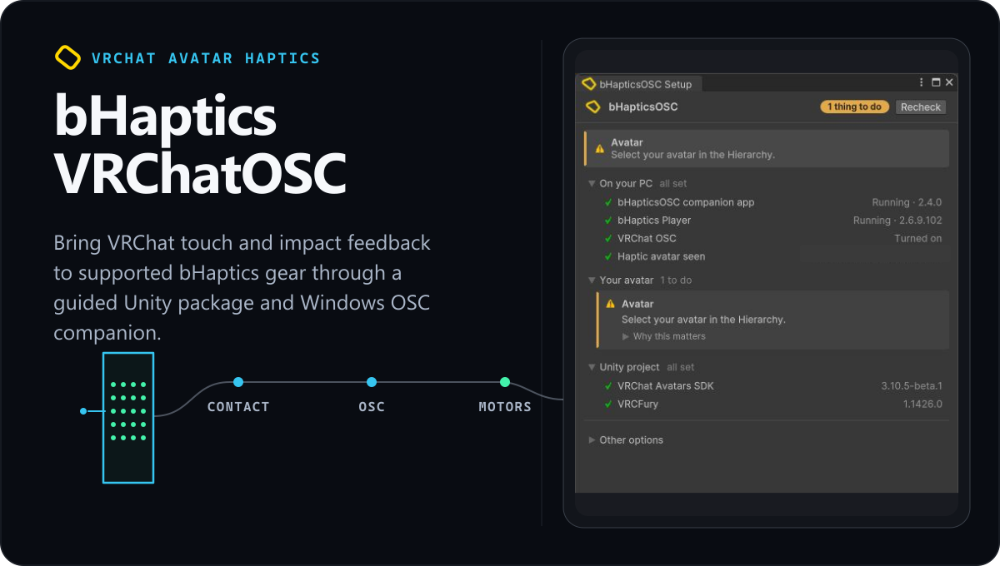

  

# bHaptics VRChatOSC

Bring VRChat touch and impact feedback to supported bHaptics gear through a guided Unity package and Windows OSC companion.

bHaptics VRChatOSC is the Furroxide-maintained fork of the original integration. It pairs a VCC avatar package with a Windows companion app, adds a guided Setup Assistant, and uses VRCFury to keep generated avatar changes separate from your own controllers and menus.

> [!NOTE]
> **First stable release.** The preview period is over. This is a young project with a small user base, so if something does not work on your setup, please [open an issue](https://github.com/furroxide/bHapticsVRChat/issues) and it will be looked at.

## Choose your path

### Play with a supported avatar

1. Install [bHaptics Player](https://www.bhaptics.com/support/downloads), pair your devices, and leave it running.
2. Download and run the maintained [bHapticsOSC companion app](https://github.com/furroxide/bHapticsVRChat/releases/latest/download/bHapticsOSC.exe).
3. In VRChat, turn on **Action Menu → OSC → Enabled**.
4. Use an avatar with bHapticsOSC support and keep both desktop apps open while you play.

### Add bHaptics to your avatar

1. Open a humanoid avatar project in VRChat Creator Companion using Unity `2022.3.22f1`.
2. Add the VRCFury VCC repository (`https://vcc.vrcfury.com/`) and the [bHaptics VRChatOSC repository](https://furroxide.github.io/bHapticsVRChat/index.json).
3. From **Manage Project**, install **bHaptics VRChatOSC**, then open the project in Unity.
4. Select the avatar root and open **bHapticsOSC → Setup Assistant**. Review the proposal, run its one-action avatar setup, and upload through the VRChat SDK.

The Setup Assistant promotes the next action that needs attention. It can install or locate the companion app, check bHaptics Player and VRChat OSC, fit devices to the selected avatar, and build the VRCFury setup as one undoable operation.

## Coming Soon

Want to help shape what comes next? Sponsors get early access and help choose future VRChat feature integrations through private sponsor updates. [Sponsor Furroxide on GitHub →](https://github.com/sponsors/furroxide)

## How it works

**Avatar contacts → VRChat OSC → bHapticsOSC companion → bHaptics Player → bHaptics gear**

When an avatar creator opts into Contact Compressor, the avatar build replaces dense contact grids with compact positional receivers. With or without that optional compression, VRChat sends contact positions over OSC, the maintained companion translates them into device motor output, and bHaptics Player drives the paired hardware.

The Unity Setup Assistant observes each part of that chain and reports whether the companion, Player, OSC configuration, project dependencies, and selected avatar are ready.

## Compatibility and limits

| Area | Requirement or limitation |
| --- | --- |
| Companion app | `bHapticsOSC.exe` runs on Windows and must run on the same Windows PC as VRChat. The Unity assistant remains available on macOS and Linux for guidance, but it cannot run the companion there. |
| Avatar project | Unity `2022.3.22f1`, VRChat Avatars SDK `3.10.x`, and VRCFury `1.1341.0` or newer in the `1.x` series. |
| Avatar platforms | The package includes PC and Quest-compatible avatar assets. Quest-compatible describes the uploaded avatar assets; it does not make the Windows companion available on standalone Quest. |
| Installation | VCC/VPM is recommended. A legacy `.unitypackage` is available as a fallback; never install both formats in the same project. |
| Companion lineage | The official `bHapticsOSC_v2.2.1.exe` and older releases are a different build. They do not understand this fork's optional compressed-contact parameters, so use the maintained download linked above. |

## Guides and support

- [Set up bHaptics VRChatOSC](docs/setting-up.md)
- [Upgrade an existing installation](docs/upgrading.md)
- [Understand Contact Compressor](docs/contact-compression.md)
- [Read VRChat's OSC overview](https://docs.vrchat.com/docs/osc-overview)
- [Download the latest release](https://github.com/furroxide/bHapticsVRChat/releases/latest)
- [Report a bug or request help](https://github.com/furroxide/bHapticsVRChat/issues)

Legacy resources

- The [bHaptics Avatar World](https://vrchat.com/home/world/wrld_7b1fed5e-50da-4263-b68a-81344fab1ac7) is retained as a legacy resource, not the primary setup or validation path for this maintained fork.

## Development

See [Development](docs/development.md) for cloning, building, testing, packaging, release artifacts, and versioning instructions. Before contributing, also read [CONTRIBUTING.md](CONTRIBUTING.md) for the repository's line-ending and generated-file policies.

## License

bHaptics VRChatOSC is licensed under [GPL-3.0-only](LICENSE.md) and is based on the original bHapticsOSC project. [VRCFury](https://vrcfury.com/) is an external VCC dependency and is not redistributed here.
